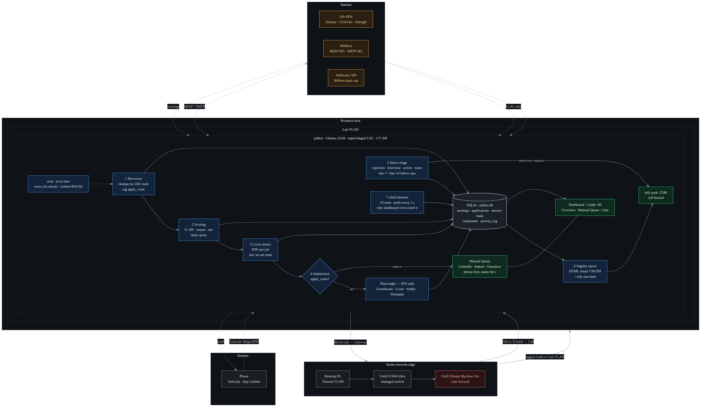

# jobbot

A self-hosted, AI-driven job-application pipeline that runs in an isolated container on a home lab. Eight agents discover postings, score them against your resume, write cover letters, assemble and submit applications, read your inbox, chase follow-ups, and email you a report every night. A dashboard shows the whole operation as live 3D scenes.

Built with Claude Code across nine sessions. Retired after its author accepted an offer. Published so you can run your own.



## What it does

| Layer | Job | Runs |
|---|---|---|
| 1. Tracker | SQLite: postings, applications, answer bank, commands, activity log (tokens and duration on every row) | always |
| 2. Dashboard | Overview, Queue, Inbox, Applications, Submissions, Answers, Agents, Chat. Served by Caddy | always |
| 3. Discovery | Pull from Adzuna, USAJobs, Jobright, and email alerts. Deduplicate by URL hash. Tag each posting with an apply route | 6:00 AM, 11:00 AM, 2:00 PM, 5:00 PM |
| 4. Scoring | 0 to 100 against the resume, one-line reason, tier, daily quota filled from the top. Never re-scores a job already in the database | after discovery |
| 5. Cover letters | One PDF per job that asks for one. Drafts with an em dash, an "I am writing to" opener, or a "not X, but Y" construction are rejected and regenerated | after scoring |
| 6. Submission | ATS forms (Greenhouse, Lever, Ashby, Workable) filled by Playwright from the answer bank. Everything else goes to the Manual Queue | 8:00 AM, 11:00 AM, 2:00 PM, 5:00 PM |
| 7. Inbox triage | Classify replies as rejection, interview request, action needed, or noise. Update the tracker. Day-7 and day-14 follow-ups. Interview requests push to your phone | 12:00 PM, 6:30 PM |
| 8. Nightly report | Full HTML email plus a one-line ntfy summary | 7:00 PM |
| 9. Agent chat | `chatd`, a tool-calling daemon you can ask questions from the dashboard | always |

Every layer writes to the same `activity_log`. The Agents page replays it so you can answer "why did it do that" weeks later.

## What it does not do

- It never scripts LinkedIn, Indeed, Glassdoor, or Jobright native forms. Those platforms forbid bots. Those jobs go to the Manual Queue, a phone-first page you can clear in about a minute per job.
- It never attempts a CAPTCHA or a human-verification wall. It remembers the domain and routes it to you from then on.
- It never infers export-control or clearance answers. Exact matches from the answer bank or the job goes to you.
- It never modifies your resume. The file is mode 444 and ships byte-for-byte.
- It never sends email from chat. `draft_email` returns a draft.

Read [SECURITY.md](SECURITY.md) before you run it.

## Where it runs

jobbot ingests untrusted text all day and holds real credentials, so isolation comes before features.

- Unprivileged Ubuntu 24.04 LXC on Proxmox (2 cores, 4 GiB RAM, 32 GiB disk)
- Its own VLAN, with the router's zone firewall in the path: allow your trusted network in, block the container from the gateway's own services
- `ufw` inside the container: deny all inbound except the trusted VLAN and the Tailscale interface
- Tailscale with MagicDNS for remote access. Nothing port-forwarded on the WAN
- Caddy on :80 for the dashboard, self-hosted ntfy on :2586 for push
- `.env` mode 600, resume mode 444, neither in git

`docs/architecture.mmd` is the Mermaid source for the diagram above. Full step-by-step for running your own copy: [docs/REPRODUCTION.md](docs/REPRODUCTION.md). Full writeup with dashboard screenshots: [I Built a Bot to Apply to Jobs for Me. Then a Referral Got Me the Job.](https://mycyberworld.org/?p=921)

## Quickstart

1. **Build the box.** Follow [docs/BUILD-GUIDE.md](docs/BUILD-GUIDE.md): container, VLAN, TUN device for Tailscale, timezone first, `ufw`, Caddy, ntfy. The guide ends with a connection test for every external dependency. Do not skip it.
2. **Credentials.** Copy `.env.example` to `.env`, fill it in, `chmod 600 .env`. Set a monthly spend cap on your API key before you paste it.
3. **Answer bank.** Copy `config/application-answers.example.md` to `config/application-answers.md` and fill it in. The submit head only fills fields it can source from this file; anything else routes to you.
4. **Identity and resume.** Copy `config/identity.example.json` to `identity.json`, fill it in, `chmod 600 identity.json`. Drop your resume PDF in the project root as `resume.pdf` (or set `RESUME_PATH`) and `chmod 444` it.
5. **Install.** `python3 -m venv venv && ./venv/bin/pip install -r requirements.txt && ./venv/bin/playwright install chromium`
6. **Initialize.** `./venv/bin/python -c "import sys; sys.path.insert(0, 'pipeline'); import db; db.init_db(); print('schema ok at', db.DB_PATH)"`
7. **Schedule and services.** `crontab deploy/crontab`, then `sudo bash deploy/install-services.sh` for the dashboard and chat daemon.
8. **Dry run.** The shipped config is safe: `submission.dry_run` is true and the browser head is disabled. Run discovery, scoring, and letters. Read the dashboard at `http://<container-ip>`. Read two nightly reports.
9. **Go live, carefully.** Keep `quota.daily_max` at 10, flip `submission.dry_run` to false in `config.json`, and watch the first twenty confirmation screenshots on the Submissions page before enabling `submission.auto_submit`.
10. **Kill switch.** `touch PAUSE` in the project root stops every scheduled job. `rm PAUSE` resumes.

## Repository layout

```
jobbot/
├── pipeline/                    # every stage the cron schedule runs
│   ├── db.py                    #   SQLite layer: schema, runs, activity log, dedup
│   ├── discovery.py · scoring.py · letters.py · materials.py   # 6:00 AM chain
│   ├── submission.py · autosubmit.py                           # 8:00 AM batch + browser head
│   ├── topup.py                 #   through-the-day quota top-up
│   ├── inbox.py · mailer.py · report.py · notify.py            # mail in, mail out, report, push
│   ├── chatd.py · chat_tools.py #   dashboard chat daemon and its tools
│   ├── web.py                   #   dashboard API (Flask/waitress behind Caddy)
│   ├── answers.py               #   answer-bank parser; nothing is ever invented
│   ├── sources/                 #   discovery: ATS endpoints, Adzuna, USAJobs, inbox alerts
│   └── schema.sql · seed.py     #   schema and demo data
├── dashboard/                   # static pages + assets Caddy serves; talks to web.py
├── config/
│   ├── application-answers.example.md   # copy to config/application-answers.md, fill in
│   ├── identity.example.json    #   copy to ./identity.json (mode 600)
│   └── targets.example.json     #   copy to ./targets.json: your company watchlist
├── deploy/                      # crontab, Caddyfile, systemd units, ntfy config, install scripts
├── docs/
│   ├── BUILD-GUIDE.md           # container, VLAN, firewall, Tailscale, mail, ntfy — the full build
│   ├── REPRODUCTION.md          # from clone to first live send
│   ├── architecture.{png,svg,mmd}
│   └── *.md                     # design specs the build sessions worked from
├── scripts/                     # standalone connection tests (real sends; not collected by pytest)
├── tests/                       # pytest suite (168 tests); safe on a fresh clone
├── config.json                  # pipeline knobs; ships with every safety default on
├── CLAUDE.md                    # rules, schedule, writing standards; loaded by every Claude Code session
├── .env.example · requirements.txt · pytest.ini
├── SECURITY.md · PUBLISHING.md
└── LICENSE                      # MIT
```

## Cost

One month of live running cost $15.42 in API calls against a $40 cap: letter writer $7.58, scoring $2.34, chat agent $4.08, inbox reader $1.42. Everything else is free and self-hosted.

## How it was built

Nine Claude Code sessions, one layer each, with a `CLAUDE.md` carrying the rules and a handoff note at the end of every session. Proxmox snapshot between sessions. Every session that created something new proposed the structure and stopped for review before writing code. Submission ran in dry-run for two full sessions before the first live flag flip. The full writeup is at [mycyberworld.org](https://mycyberworld.org/?p=921).

## Responsible use

jobbot was built for one person's job search, on one person's hardware, with one person's resume. It submits only through applicant tracking systems on the employer's own domain, never through job boards that prohibit automation, and it never bypasses a CAPTCHA or a human-verification wall. Every application it sent was one the author would have sent by hand. If you run it, keep those lines.

## License

MIT. See [LICENSE](LICENSE).
